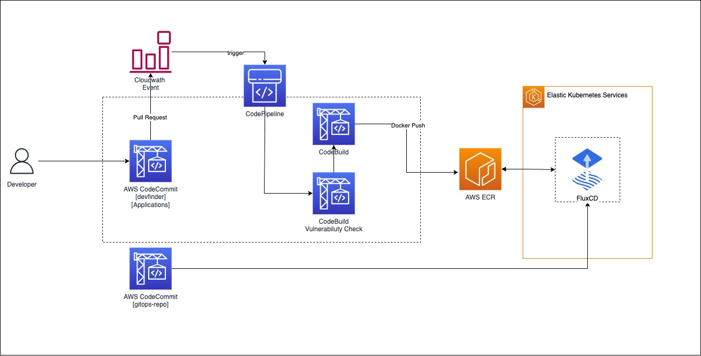

# aws-demo-gitops-flux
Time to Demo [AWS Marathon]. Acelerando los flujos de trabajo en EKS con GitOps + Flux  by RoxsRoss

GitOps es un nuevo enfoque para la implementación continua que aprovecha Git como una única fuente de verdad para la infraestructura declarativa y las aplicaciones, proporcionando tanto control de revisiones como de cambios. Con GitOps, un sistema se ejecuta mediante el envío de solicitudes de extracción o “pull requests” (y combinaciones posteriores) para lograr el estado deseado del sistema representado en un repositorio de Git.

Con GitOps, se declara el estado deseado de los clústeres de Kubernetes en archivos en repositorios de Git. Los repositorios de Git pueden contener los siguientes archivos:

- Manifiestos en formato YAML que describen recursos de Kubernetes (como espacios de nombres, secretos, implementaciones, etc.)
- Helm para implementar aplicaciones
- Archivos de Kustomize para describir cambios específicos del entorno

En este tutorial va a configurar una solución de CI/CD con GitOps con Flux v2

Siguiendo la documentación de la pagina oficial: https://fluxcd.io/flux/get-started/

Nuestra arquitectura está formada por un pipeline en el que los desarrolladores y devops llevan a cabo el CI y luego confían en FluxCD como CD.

El Pipeline tiene dos etapas principales:

Codigo : AWS CodeCommit almacena el repositorio de aplicaciones y el repositorio de infraestructura de Kubernetes. Un evento ocurre [Pull Request] en el repositorio de la aplicación y activa el pipeline.

Build_1 : AWS CodeBuild busca un security_buildspec.yaml para revisar vulnerabilidades de nuestra aplicación antes de proceder a la contrucción de la aplicacion.

Build_2 : AWS CodeBuild busca un buildspec.yaml para compilar y envía nuestra aplicación de contenedor a Amazon Elastic Container Registry (Amazon ECR).

Material en Repositorio:

- Nuestras buildspec.yaml para revisión de vulnerabilidades con las tools [Horusec, Snyk, hadolint, trivy] y Contrucción de imagen Docker además push a ECR

[buildspec.yam](./codebuild/resources/buildspec-build.yml)

- K8s Tools, Varias herramientas utiles para usar en Cloud9 o en un entorno local. 
    para instalar solo es necesario ./install.sh *recuerden darle permiso de ejecución*
    [install](./k8stools/install.sh)

- Kustomize es una herramienta que nos sirve para “kustomizar” configuración de aplicaciones en Kubernetes, donde estaran las bases de nuestra demo
    [devfinder](./kustomize/apps.yaml)

Documentación de AWS Recomendada [Gitops](https://community.aws/tutorials/using-flux-to-implement-gitops-on-aws)

### 🔥

---
### **Puedes Seguirme** 🔥 &nbsp;

 
